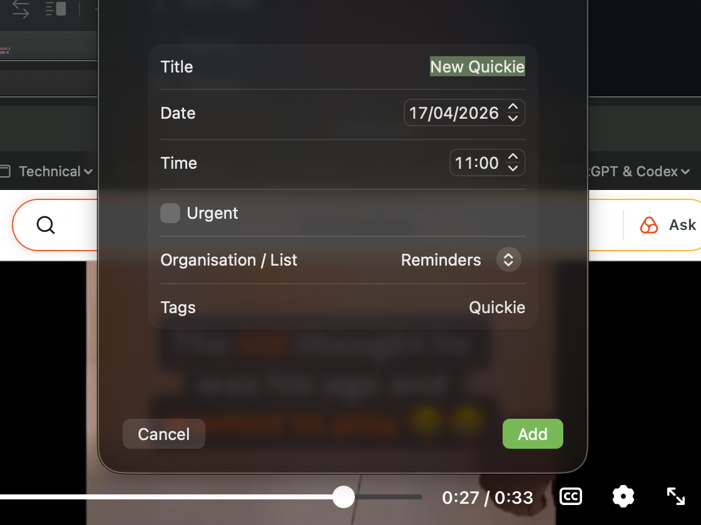
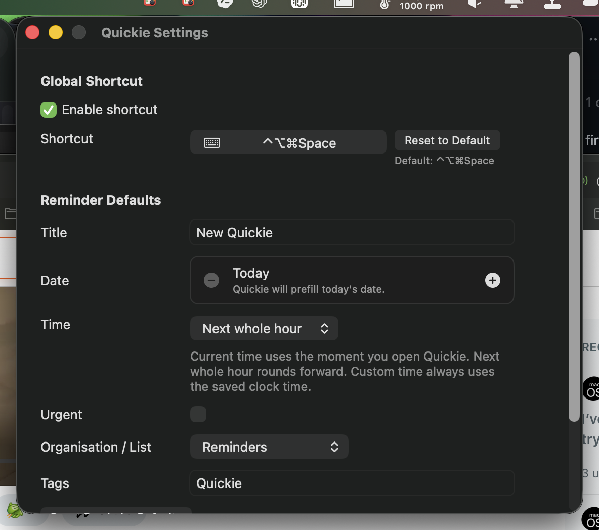

# Quickie

## About The Project

Quickie is a macOS menu bar app for getting reminders into Apple's Reminders app before the thought disappears. Click the status item, fill in the reminder form, and save straight into a selected Reminders list without opening the full Reminders UI first.

The app is built around a compact SwiftUI form, a status bar presence, a right-click utility menu, help content, and a configurable global shortcut so Quickie can be summoned from anywhere on the desktop.

## Built With

- Swift 6
- SwiftUI
- AppKit
- EventKit
- XcodeGen
- XCTest

## Getting Started

Clone the repository, generate the Xcode project from `project.yml`, then build and run Quickie in Xcode or from the command line.

## Prerequisites

- macOS 14.0 or later
- Xcode 16 or later
- [XcodeGen](https://github.com/yonaskolb/XcodeGen)
- Reminders access enabled for the built app in macOS Privacy & Security settings

## Installation

1. Clone the repository:

   ```bash
   git clone https://github.com/boggybumblebee/quickie.git
   cd quickie
   ```

2. Generate the Xcode project from the source of truth:

   ```bash
   xcodegen generate --project-root Sources --project .
   ```

3. Build and test the main app scheme:

   ```bash
   xcodebuild -project Quickie.xcodeproj -scheme Quickie -destination 'platform=macOS' test CODE_SIGNING_ALLOWED=NO
   ```

4. Open the project in Xcode when you want to run the app interactively:

   ```bash
   open Quickie.xcodeproj
   ```

## Usage

1. Launch Quickie.
2. Click the Quickie icon in the macOS menu bar, or use the configured global shortcut.
3. Fill in the reminder details:
   - Title
   - Date
   - Time
   - Urgent
   - Organisation / List
   - Tags
4. Choose **Add** to create the reminder in Apple Reminders.
5. Choose **Cancel** to clear the form and dismiss Quickie.

Quickie also includes:

- A Settings window for the global shortcut and default reminder values
- Help pages for Quick Start and troubleshooting
- A right-click status item menu with About, Help, Settings, and Quit actions

## Screenshots

These screenshots reflect the current app UI and may drift slightly as Quickie evolves.
Last updated for Quickie 1.0 (1) on April 17, 2026.

### Menu Bar Form



### Settings Window



## Roadmap

- [ ] Add GitHub Actions
- [ ] Add sonarcloud.io integration
- [ ] Update to a simpler icon, and a monochrome one for the macOS Menu Bar
- [ ] Add Unit Tests

## Contributing

Contributions are welcome. A good starting point is to open an issue describing the change, bug, or idea you want to work on so the direction stays clear before code starts moving.

When contributing code:

1. Keep `project.yml` as the source of truth for project structure.
2. Regenerate `Quickie.xcodeproj` with XcodeGen after project configuration changes.
3. Run the `Quickie` scheme tests before opening a pull request.
4. Use the `QuickieUI` scheme for UI automation work when the local macOS automation environment is available.

## License

Distributed under the MIT License. See [LICENSE.md](LICENSE.md) for the full text.

## Contact

Project home: [github.com/boggybumblebee/quickie](https://github.com/boggybumblebee/quickie)

For questions, bug reports, or ideas, please use the repository issue tracker.

## Acknowledgments

- Apple for SwiftUI, AppKit, and EventKit
- The XcodeGen project for keeping `project.yml` as the project source of truth
- Everyone who prefers capturing reminders quickly instead of losing them to context switching
